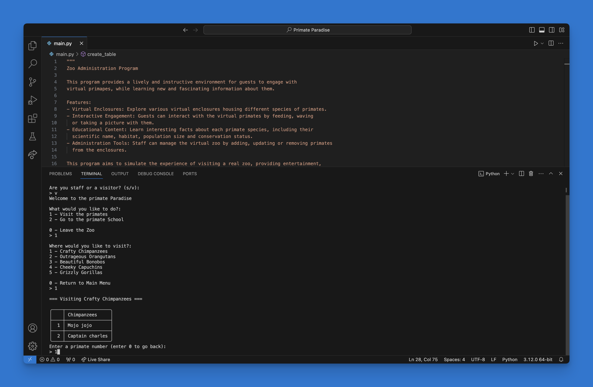

# 🐒 Primate paradise

Dive into a virtual world of Primates! This python based zoo administration program offers an engaging and educational experience where visitors can interact with virtual animals and discover fascinating insights into their habitats, population size and conservation status. Users can access zoo staff tools and manage the virtual zoo by adding, updating or removing primates from the enclosures (password = banana).
 

## Features

- Virtual Enclosures: Explore various virtual enclosures housing different species of primates.
- Interactive Engagement: Guests can interact with the virtual primates by feeding, waving 
  or taking a picture with them.
- Educational Content: Learn interesting facts about each primate species, including their
  scientific name, habitat, population size and conservation status.
- Administration Tools: Staff can manage the virtual zoo by adding, updating or removing primates
  from the enclosures.


## Installation

- Download and install an IDE - [Visual Studio Code](https://code.visualstudio.com/), [PyCharm](https://www.jetbrains.com/pycharm/) etc
- Download and install [Python](https://www.python.org/downloads/)
- Clone the repository to a local directory - [GitHub Tutorial](https://docs.github.com/en/repositories/creating-and-managing-repositories/cloning-a-repository)
- Open the files in your chosen IDE 
- Install tabulate and playsound
```
  pip install tabulate
  pip install playsound
```
- Run the main.py file

    
## Screenshot




## Authors

- [@BorivojTodorcic](https://github.com/BorivojTodorcic/)

